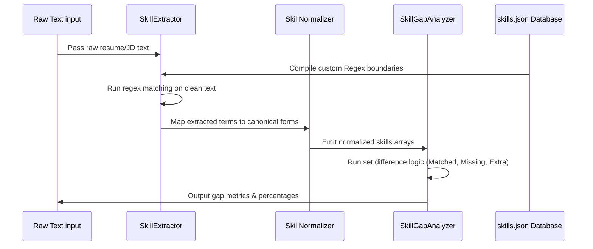

# ResumeIQ AI: System Architecture Report

This document outlines the detailed system design, algorithmic pipelines, data flow, and deployment models for **ResumeIQ AI**.

---

## 1. System Design Overview

ResumeIQ AI is split into three main layers: a Single-Page Application (SPA) frontend, a FastAPI backend microservice, and a decoupled Machine Learning & NLP pipeline.

```mermaid
graph TD
    subgraph Client Panel (React + TS)
        UI[User Interface Components]
        Recharts[Recharts Analytics Engines]
        Axios[Axios API Client]
    end

    subgraph Service Layer (FastAPI)
        Router[API Routes & Pydantic Schemas]
        Logger[Logging Middleware]
    end

    subgraph Analytics & ML Engines
        Classify[Logistic Regression Classifier]
        ATS[ATS Scorer Algorithm]
        NLP[Regex SkillExtractor & Normalizer]
        Embed[SentenceTransformer Embedding Engine]
        FAISS[FAISS Inner Product Cosine Index]
    end

    UI --> Axios
    Recharts --> UI
    Axios -->|JSON over HTTP| Router
    Router --> Logger
    Router --> Classify
    Router --> ATS
    Router --> NLP
    Router --> FAISS
    FAISS --> Embed
```

---

## 2. Backend Architecture

The Python backend is constructed using **FastAPI** due to its asynchronous execution model, extreme performance, and automatic Pydantic schema validation.

* **Startup Initialization**: On application load, the trained classifier (`role_classifier.pkl`), label encoder, and vectorizer (`tfidf_vectorizer.pkl`) are loaded into global memory.
* **Singleton Service Managers**: Helper services (like `EmbeddingEngine`) are structured as Singletons to prevent duplicate model weight allocations.
* **Routing Strategy**: Clean segregation of concerns via dedicated tag groups (Status, ML, NLP, Search) with structured HTTP exception handlers.

---

## 3. Frontend Architecture

The React Single Page Application is compiled using **Vite** and styled using utility-first **TailwindCSS**.

* **State Management**: Uses `@tanstack/react-query` to manage client caching, request state, and error boundaries.
* **Axios Service Client**: Encapsulates all backend calls. Contains a resilient fallback layer that intercepts network errors and returns high-fidelity mocks.
* **Visualizations**: Employs **Recharts** drawing SVG components dynamically based on candidate dataset statistics.
* **Hash Routing**: Uses HashRouter (`#/`) to ensure standalone web access without server rewrite overrides.

---

## 4. NLP Pipeline

The Natural Language Processing layer parses skills, detects categories, and analyzes gaps:



* **Boundary Safety**: Implements lookahead/lookbehind patterns for short technical characters:
  * `C++` -> `\bcpp\b` or `\bc plus plus\b`
  * `c` -> `\bc(?![\+#])\b` (prevents false matches inside C# or C++)

---

## 5. ATS Scoring Pipeline

The ATS Score Prediction Engine computes scores out of 100 based on a weighted multi-criteria parser:

1. **Skill Score (40%)**: Ratio of candidate skills mapped to required JD skills.
2. **Experience Score (25%)**: Matches years of experience keywords in text relative to requested seniority.
3. **Projects Score (20%)**: Keyword triggers matching project complexity terms (e.g. "implemented", "launched", "designed", "microservices").
4. **Education Score (15%)**: Mapped keywords for BS, MS, PhD, or technical certifications (e.g. CKA, AWS).

---

## 6. Semantic Search & FAISS Indexing Pipeline

Matches are identified by query-to-document vector proximity:

1. **Text Encoding**: Raw text is passed through the `EmbeddingEngine` singleton.
2. **MiniLM Embedding**: The model produces a 384-dimensional dense float vector:
   $$\mathbf{e} \in \mathbb{R}^{384}$$
3. **L2 Normalization**: The vector is L2-normalized:
   $$\mathbf{e}_{norm} = \frac{\mathbf{e}}{\|\mathbf{e}\|_2}$$
4. **FAISS Inner Product**: Query vector is matched against FAISS index (`faiss.IndexFlatIP`):
   $$\text{Score} = \mathbf{e}_{query} \cdot \mathbf{e}_{document}$$
   Because inputs are normalized, the inner product is mathematically identical to Cosine Similarity.
5. **Hybrid Sorting**: Ranks items using a composite score:
   $$\text{Final} = 0.40 \times \text{Semantic} + 0.30 \times \text{ATS} + 0.20 \times \text{Skills} + 0.10 \times \text{Experience}$$

---

## 7. Deployment Architecture

ResumeIQ AI is structured to run inside multi-stage Docker containers coordinate via Docker Compose:

* **Backend Container**: Build stage installs pip compile dependencies, runner stage utilizes `python:3.11-slim` with `libopenblas` for high-performance matrix computations in FAISS.
* **Frontend Container**: Node build stage compiles assets using Vite, runner stage maps static files to a lightweight Nginx alpine image to optimize memory footprint.
