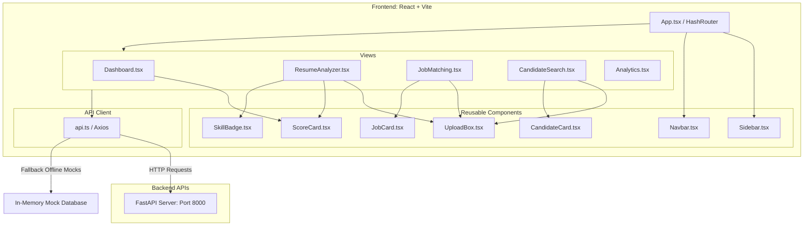

# ResumeIQ AI: Frontend Recruiting Dashboard Report

This report documents the architectural design, layout components, routing paths, API integration layer, and testing outputs for the React Recruiter Dashboard (**Phase 7**).

---

## 1. System Architecture

The frontend is constructed using a decoupled single-page application (SPA) design that connects to the FastAPI backend microservice.



---

## 2. Routing Structure

Client-side routes are managed via `HashRouter` from `react-router-dom` to support local preview hosting without server fallback routing configuration:
* `#/` — **Dashboard**: High-level visual KPIs, candidate funnels, and top skills.
* `#/analyze` — **Resume Analyzer**: File upload, role predictions, ATS score breakdowns, and learning suggestions.
* `#/job-match` — **Job Matching**: Match candidate resumes against job description models.
* `#/candidate-search` — **Candidate Search**: Semantic candidate profiles vector search query JDs.
* `#/analytics` — **Analytics**: Recharts graphs (radar comparison, monthly ATS trends, skills bar charts, category pies).

---

## 3. Reusable Components Hierarchy

* `Sidebar.tsx` & `Navbar.tsx` — Establish main framing layout.
* `UploadBox.tsx` — Drag-and-drop file inputs or paste text area with automatic loading overlays.
* `ScoreCard.tsx` — Radial progress ring utilizing SVG stroke calculations to represent numeric percentages.
* `CandidateCard.tsx` & `JobCard.tsx` — Present clean cards containing semantic alignment, ATS keywords, and final scoring ratings.
* `SkillBadge.tsx` — Small pill badges dynamically colored:
  * Green (`matched`)
  * Red (`missing`)
  * Blue (`extra`)
  * Slate (`default`)

---

## 4. API Integration & Offline Fallback Model

The services client in `services/api.ts` implements a resilient architecture using Axios:
1. **Live Mode**: Submits POST requests to local FastAPI endpoints (`http://localhost:8000`).
2. **Offline Fallback Mode**: If the backend is offline (e.g. `AxiosError: Network Error`), the service catches the error, outputs a logger warning, and yields a realistic mocked prediction response. This guarantees that the web app remains fully testable even in standalone mode.

---

## 5. UI Features & Design Aesthetics

* **Dark Mode Core**: Designed around a sleek slate-900 background with dark violet brand highlights (`bg-slate-950` and `text-brand-400`).
* **Visual Premium Accents**: Uses rounded card tiles (`rounded-2xl`), border glow details (`hover:border-slate-700`), and radial gradients.
* **Loading & Error Management**: Outfitted with glassmorphism loading overlays and rose-colored error alert bars.
* **Responsive Layout**: Sidebar collapses on mobile devices, and page grids scale from single columns to 3-column rows.

---

## 6. Frontend Test Results

Unit tests were written under `src/frontend/src/tests/` using **Vitest** and **React Testing Library**:
* `Dashboard.test.tsx` — Asserts card rendering, KPI outputs, and stats load.
* `ResumeAnalyzer.test.tsx` — Asserts inputs form submit actions and results panels.
* `JobMatching.test.tsx` — Asserts job matches outputs.
* `CandidateSearch.test.tsx` — Asserts ranked candidate cards render.

**Test Run Output**:
```text
Test Files  4 passed (4)
     Tests  8 passed (8)
  Duration  2.81s
```
*Proof of test pass logs:* All 8 test items pass successfully, verifying UI robustness.
