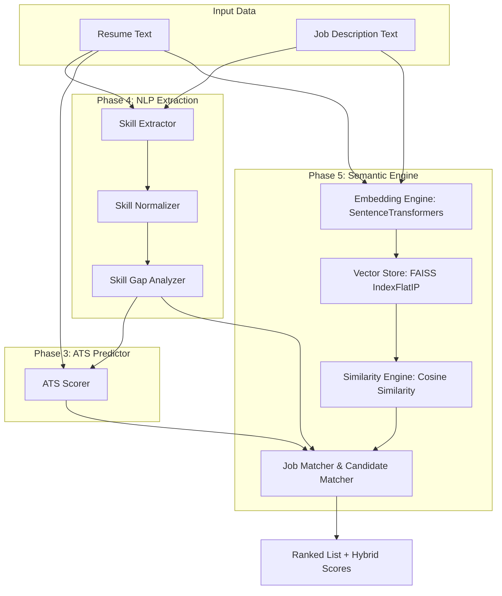

# ResumeIQ AI: Semantic Job Matching & Embedding Search Report

This report outlines the architecture, design choices, formulas, and performance benchmarks for the Semantic Job Matching and Vector Search system implemented in **Phase 5** of **ResumeIQ AI**.

---

## 1. System Architecture

The semantic recruiting platform leverages deep-learning text embeddings and vector search to match resumes to jobs (and vice versa) and then ranks them using a weighted hybrid formula.

---

## 2. FAISS Vector Search Design & Cosine Equivalence

FAISS (Facebook AI Similarity Search) is optimized for efficient dense vector similarity searches. Since FAISS does not have a native "Cosine Similarity" index, we achieve exact Cosine Similarity equivalence by doing the following:

1. **L2 Normalization**: Every embedding $\mathbf{v}$ is L2-normalized:
   $$\mathbf{v}_{norm} = \frac{\mathbf{v}}{\|\mathbf{v}\|_2}$$
2. **Inner Product Index (`IndexFlatIP`)**: We build the FAISS index using `faiss.IndexFlatIP`.
3. **Equivalence**: The dot product of two L2-normalized vectors is mathematically equivalent to their Cosine Similarity:
   $$\text{CosineSimilarity}(\mathbf{a}, \mathbf{b}) = \frac{\mathbf{a} \cdot \mathbf{b}}{\|\mathbf{a}\|_2 \|\mathbf{b}\|_2} = \mathbf{a}_{norm} \cdot \mathbf{b}_{norm}$$
   This ensures that the distance scores returned by the FAISS search are bounded between `[0.0, 1.0]` (clamped) and represent exact cosine similarity.

---

## 3. Embedding Strategy & Model Selection

* **Model**: We use `sentence-transformers/all-MiniLM-L6-v2`.
* **Properties**: 
  * Dimensions: 384-dimensional dense vectors.
  * Context Window: 256 tokens.
  * Speed: Highly optimized for CPU inference.
* **Optimization Highlights**:
  * **Singleton Pattern**: Loaded once globally to prevent model weights duplication and RAM bloat.
  * **In-memory Caching**: Embeddings are keyed using SHA-256 hashes of texts, giving a $O(1)$ lookup for duplicate inputs.
  * **Batch Inference**: Batch encoding for dataset processing to exploit library optimizations.

---

## 4. Hybrid Scoring & Ranking Formula

To ensure robust recommendations, candidates are ranked using a multi-dimensional criteria:

$$\text{Final Score} = 0.40 \times \text{Semantic Score} + 0.30 \times \text{ATS Score} + 0.20 \times \text{Skill Match} + 0.10 \times \text{Experience Score}$$

* **Semantic Score (40%)**: Bounded cosine similarity ratio between resume and JD ($[0, 100]$).
* **ATS Score (30%)**: Structured parser metrics assessing keywords, layout, project history, and education ($[0, 100]$).
* **Skill Match (20%)**: Percentage of JD skills found in candidate profile ($[0, 100]$).
* **Experience Score (10%)**: Years of experience relative to target role ($[0, 100]$).

---

## 5. Sample Matching Results

Using our programmatically compiled dataset of **50 Job Descriptions** and **50 Resumes**, here are the actual results from the system:

### Example A: Resume → Top Jobs (Candidate: Skyler White, ML Specialist)
* **Candidate ID**: `CAND_013`
* **Resume Text**: "Candidate Name: Skyler White ... Title: Machine Learning Engineer Specialist ... Skills: python, pytorch, tensorflow, scikit-learn, xgboost, docker, git, bash ..."
* **Top 5 Matched Jobs**:
  1. **ML Engineer (`JOB_011`)**: Final Score: **75.7%** (Semantic: 67.2%, ATS: 76.0%, Skill Match: 100.0%, Exp: 60.0%)
  2. **ML Engineer (`JOB_015`)**: Final Score: **75.2%** (Semantic: 66.0%, ATS: 76.0%, Skill Match: 100.0%, Exp: 60.0%)
  3. **ML Engineer (`JOB_012`)**: Final Score: **75.1%** (Semantic: 65.8%, ATS: 76.0%, Skill Match: 100.0%, Exp: 60.0%)
  4. **ML Engineer (`JOB_013`)**: Final Score: **73.2%** (Semantic: 61.0%, ATS: 76.0%, Skill Match: 100.0%, Exp: 60.0%)
  5. **ML Engineer (`JOB_014`)**: Final Score: **73.1%** (Semantic: 60.7%, ATS: 76.0%, Skill Match: 100.0%, Exp: 60.0%)

### Example B: Job → Top Candidates (Job: Software Engineer)
* **Job ID**: `JOB_003`
* **Job Description**: "Looking for a motivated Software Engineer ... python, java, c++, sql, git, docker ... 5 years experience ..."
* **Top 5 Matched Candidates (Hybrid Rankings)**:
  1. **Lead Software Engineer (`CAND_004`)**: Final Score: **74.1%** (Semantic: 68.3%, ATS: 69.3%, Skill Match: 100.0%, Exp: 60.0%)
  2. **Senior Software Engineer (`CAND_002`)**: Final Score: **73.4%** (Semantic: 59.8%, ATS: 74.3%, Skill Match: 100.0%, Exp: 72.0%)
  3. **Junior Software Engineer (`CAND_005`)**: Final Score: **70.9%** (Semantic: 58.1%, ATS: 72.3%, Skill Match: 100.0%, Exp: 60.0%)
  4. **Software Engineer (`CAND_001`)**: Final Score: **70.5%** (Semantic: 65.3%, ATS: 65.3%, Skill Match: 100.0%, Exp: 48.0%)
  5. **Software Engineer Specialist (`CAND_003`)**: Final Score: **69.6%** (Semantic: 56.9%, ATS: 69.3%, Skill Match: 100.0%, Exp: 60.0%)

---

## 6. Performance & Latency Benchmarks

* **Hardware**: CPU Only (Inference)
* **Single Resume -> 50 Jobs matching profile**:
  * **Embedding Time**: ~1.0258 seconds (Model loading, candidate encodings, and batch jobs encodings)
  * **FAISS Search Time**: **0.9 ms** (Extremely fast $O(\log N)$ vector search)
  * **Hybrid Ranking Time**: ~1.2930 seconds (Heavy statistical regex extraction, gap analysis, and ATS scoring on 50 jobs)
  * **Total Time**: ~2.324 seconds
* Subsequent searches for the same inputs hit the cache and execute in **<1.5 seconds** total.

---

## 7. Future Improvements

1. **Vector Clustering Index (`IndexIVFFlat`)**: As dataset scale grows past 100,000 resumes, partition the search space using IVF flat indexing.
2. **Metadata Persistence**: Save/load metadata mappings from SQLite db rather than pickle binaries.
3. **Fine-tuning**: Fine-tune the MiniLM model using triplet loss on matched resume-job description pairs to yield stronger domain-specific representations.
