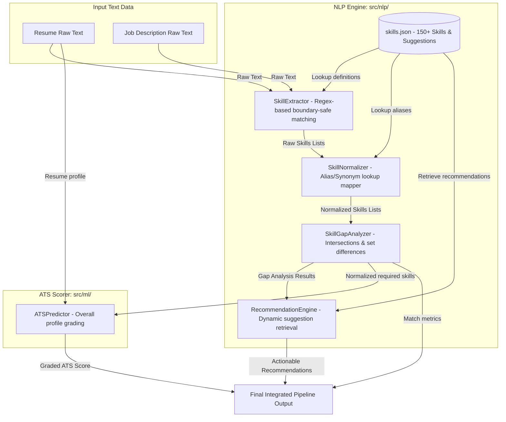

# Skill Extraction & Gap Analysis System Report

This report documents the design, architecture, implementation decisions, and validation metrics for the **Skill Extraction and Gap Analysis System** of the **ResumeIQ AI** platform (Phase 4).

---

## 1. System Architecture

The NLP package processes text streams (resumes and job descriptions), maps extracted terms to canonical items, compares sets to analyze gaps, and connects with the ATS predictor and recommendation engines.



---

## 2. Skills Database Design (`data/skills.json`)

The database is defined as a JSON dictionary mapped by canonical lowercase keys (e.g., `"pytorch"`, `"aws"`). This schema ensures index efficiency, fast deserialization, and dynamic extensibility.

### Attribute Breakdown
* **canonical (dict key)**: Standard canonical identifier, used for sets comparisons.
* **aliases**: A list of alternate spelling, acronyms, or versions (e.g., `"py"` for `"python"`, `"k8s"` for `"kubernetes"`).
* **category**: String detailing the technical sector (e.g., `programming`, `machine learning`, `devops`).
* **recommendation**: Actionable, domain-specific instruction indicating how a candidate can acquire the missing skill.

---

## 3. Extraction & Normalization Strategy

### Regex-Based Extraction
Regular Expressions were selected to ensure deterministic extraction speed and boundary safety. For each database entry, the extractor compiles matching patterns:
* **Word Boundary checks**: `\b` is used at the start and end of standard word tokens to prevent substrings matching (e.g., matching "go" inside "google" or "django").
* **Special Boundary checks**: For special characters (like `C++`, `C#`, `.NET`), standard `\b` fails at the end because punctuation is not a word character. To resolve this, a custom trailing pattern is compiled:
  `r'\b' + re.escape(term) + r'(?:\s|$|[.,;!?:])'`
  This allows matching special terms preceding spaces, end of lines, or standard sentence punctuation.

### Synonym & Alias Normalization
The `SkillNormalizer` loads synonyms and maps them to canonical keys. It performs:
- Case-insensitivity (lowercases input).
- Punctuation removal (stripping dots or hyphens: `machine-learning` -> `machine learning`, `node.js` -> `node.js`).
- Alias mappings (`py` -> `python`, `k8s` -> `kubernetes`).

---

## 4. Gap Analysis & Recommendation Logic

### Gap Analysis Formula
The `SkillGapAnalyzer` compares normalized lists:
* **Matched**: $\text{Resume Skills} \cap \text{JD Skills}$
* **Missing**: $\text{JD Skills} - \text{Resume Skills}$
* **Extra**: $\text{Resume Skills} - \text{JD Skills}$
* **Match Percentage**:
  $$\text{Match Percentage} = \frac{|\text{Matched}|}{|\text{JD Skills}|} \times 100$$
  Rounded to 2 decimal places.

### Dynamic Recommendations
The `RecommendationEngine` processes the `missing` list, queries `skills.json` for the specific skill's `recommendation` string, and returns it. If a missing skill is not listed in `skills.json`, a dynamic template is used:
`"Strengthen your skills in [SKILL] by building practice projects and review documentation."`
This guarantees that the system always produces clean, actionable recommendations without hardcoding generic logs.

---

## 5. Examples

### Example Input
* **Resume Text**:
  ```text
  John Developer. Experienced in Python, React, PostgreSQL, and git.
  ```
* **Job Description Text**:
  ```text
  Required: Python, AWS, React, Docker, and Kubernetes.
  ```

### Example Output
```json
{
  "resume_skills": ["python", "react", "postgresql", "git"],
  "jd_skills": ["python", "aws", "react", "docker", "kubernetes"],
  "matched": ["python", "react"],
  "missing": ["aws", "docker", "kubernetes"],
  "extra": ["postgresql", "git"],
  "match_percentage": 40.0,
  "ats_score": 68.2,
  "recommendations": [
    "Learn AWS fundamentals and deploy cloud projects.",
    "Build containerized applications using Docker.",
    "Gain orchestration experience with Kubernetes."
  ]
}
```

---

## 6. Future Improvements
- **Semantic Synonym Expansion**: Integrate WordNet or word embeddings to expand alias lookups for terms not explicitly declared in `skills.json`.
- **Experience weightings per skill**: Analyze sentence contexts near extracted skills to estimate experience years for each matched technology.
- **Hierarchical skill mapping**: Recognize that if a candidate knows `pytorch`, they implicitly possess general `deep learning` and `python` competencies.
